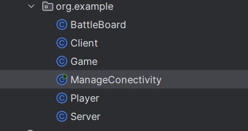
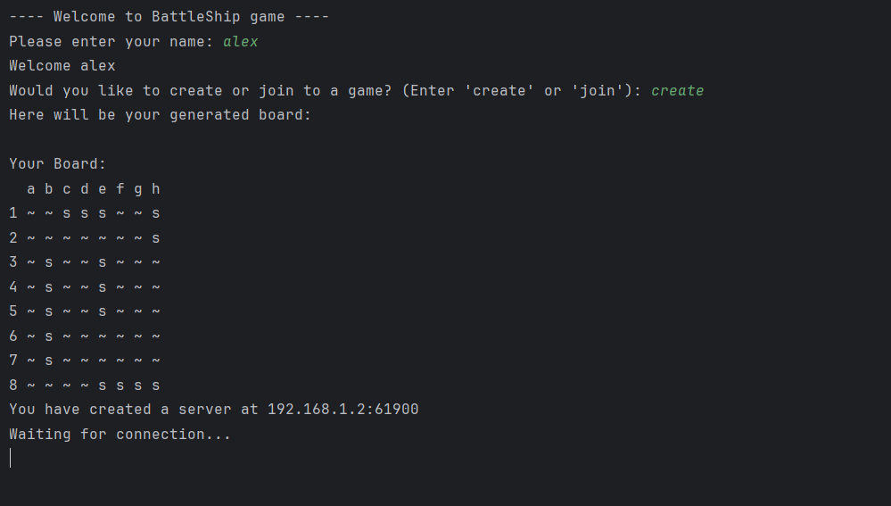
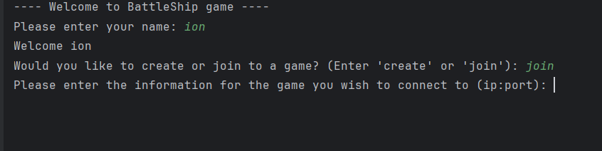
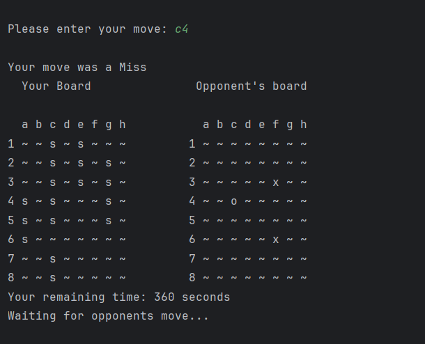
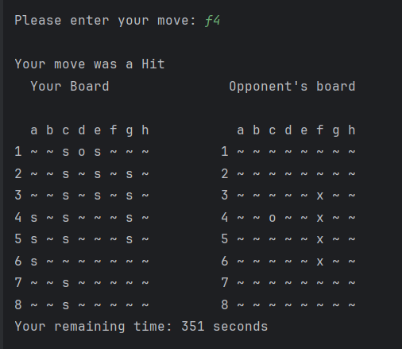

Pentru Homework am folosit o alta abordare, fiecare player reprezinta cate un proiect separat de Maven, fiecare poate sa se alature unui joc sau poate gazdui propriul server de joc. Tocmai de aceea componentele de Client si Server sunt la un loc, pentru ca in cazul unor mai multi playeri, fiecare se poate alatura unui alt server pentru a juca, sau a crea un server propriu unde sa astepte un player sa se conecteze prin intermediul socket-ului.

In cadrul fisierelor, clasa 'BattleBoard' - este responsabila cu crearea aleatoare a tablei de joc, cu actualizarea acesteia, cu verificarea unor posibile greseli pe care sa nu le faca un player (de ex o mutare gresita), cu validarea unei mutari si cu afisarea acesteia in consola jucatorului.
Clasa 'Client' este pentru jucatorul care se alatura unui lobby, iar 'Server' pentru cel care gazduieste jocul! Fiecare se ocupa cu gestionarea jocului pentru playerul respectiv, clasic, intr-o bucla "while". 'Game' este clasa care creeaza o instanta de tabla, iar 'ManageConectivity' este clasa care porneste jocul si instantiaza pe rand fiecare componenta necesara jocului prin apeluri directe in cod (clasa Server, Client), sau indirecte. Ultima clasa, 'Player' - se ocupa de gestiunea mutarilor, de ce mutari interceptez eu, ce mutari trimit eu.

Daca un player alege optiunea de a hosta un joc, acesta va crea un server pe care va juca, si va astepta ca un alt player sa se conecteze la acelasi server prin intermediul socket-ului, respectiv port-ului.

Daca alege optiunea de a se conecta la un server deja existent, nu ramane decat sa introduca datele aferente de conectare ->  ip:port

Tablele de joc sunt generate aleator. Dupa ce jocul incepe, se vor afisa 2 table pe ecran - prima e pentru pozitia navelor mele, iar a doua e pentru tabla adversarului pentru a vedea mai bine ce mutari am facut deja, unde am lovit nave si ce strategie pot aborda mai departe!

In desenarea tablei:  '~' - este pentru apa,   'x' - este pentru hit,  '0' - este pentru hit ratat, iar 's' - este pentru navele mele vizibile.

Jocul are si un timer, asa cum a fost cerut in cerinta, iar in momentul expirarii timer-ului, playerul respectiv pierde jocul. Timerul dupa fiecare mutare va lua timpul curent, si cand imi revine momentul in care trebuie sa mut, mai preia o data timpul curent (System.currentTimeMillis()), si facand diferenta, afla cate secunde a stat playerul advers la mutare si scade din timpul total ramas. Similar si invers pentru mine.

Castigatorul este cel care reuseste sa distruga toate navele adverse.