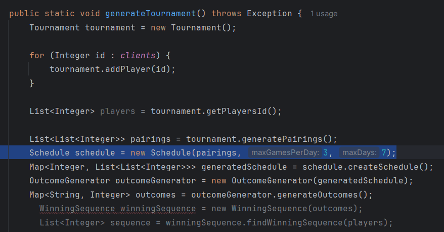

Pentru bonus am optat pentru o restructurare a proiectului pentru a putea urmari si sincroniza mai bine in cazul turnamentului. 
Proiectul Clientului este simplu si contine doar o clasa GameClient care se ocupa de conectarea la server (care e local) prin port si socket si apoi intr-un loop citeste comenzile de la tastatura si le trimite catre server prin socket, urmand sa primeasca raspunsul prin socket si sa il afiseze in terminal. Proiectul Serverului este ceva mai complex, avand clase care reprezinta navele (Ship), mapa jocului (Board), jocul in sine cu regulile sale (Game) unde sunt implementate si doua timere, cate unul pentru fiecare player, care vor opri jocul cand se termina, sau evident daca exista un castigator inainte jocul se va opri. In Tournament se retin toti playerii si se fac perechi random cu acestia pentru a decide cine cu cine joaca. 

Schedule este responsabila pentru a face programul turnamentului: cand se joaca fiecare joc, avand o constrangere de nr maxim de jocuri pe zi si nr maxim de zile in care se poate juca. 

Nr de jocuri si nr de zile alocat se poate introduce manual din cod!

OutcomeGenerator primeste acest program si urmareste cine castiga fiecare meci din turnament. WinningSequence primeste toate aceste outcomeuri si urmareste castigatorii. GameServer se ocupa de conexiunea cu clientii, dupa ce un client este acceptat acesta creeaza un thread pentru el in care isi va desfasura activitatea. 

Tot aici avem metodele de generare a unui joc si a unui turnament. ClientThread reprezentand threadul unui client are o bucla infinita in metoda run in care, in functie de comanda primita prin socket de la client, apeleaza metodele din GameServer pentru a crea un joc, un turnament, a da join unui joc deja creat, a-si construi boardul plasand navele si apoi a ataca navele oponentului. 
