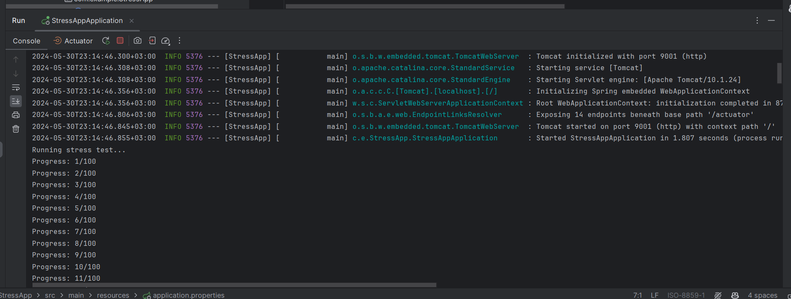
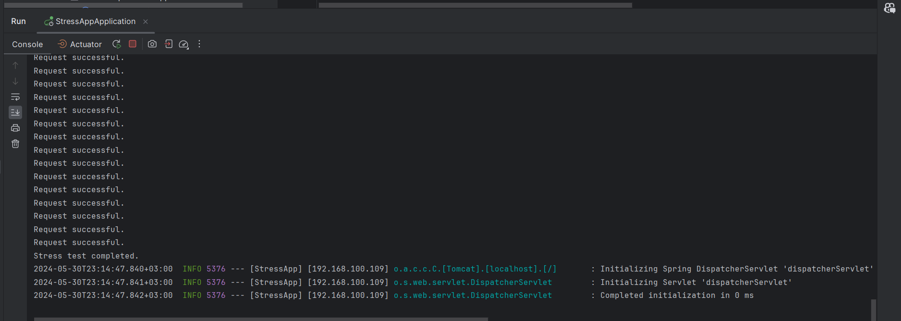
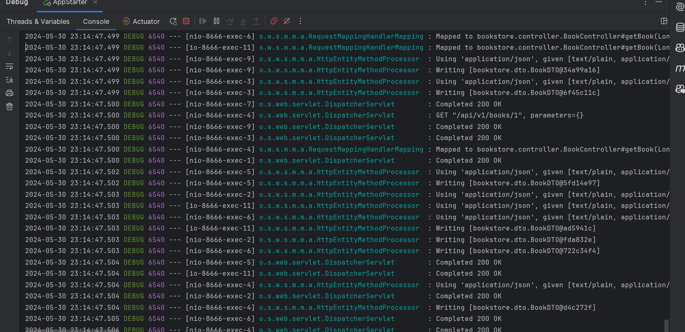

Pentru Homework sunt cateva functionalitati in plus: avand o carte, pot schimba informatii ale unui autor dintre ai sai sau sa obtin informatii despre unul dintre autorii sai.  

Pentru Bonus: Am implementat partea de algoritm, iar pentru aceasta am creat un nou tabel recommended_order care imi arata in ce ordine pot citi cartile. Am construit un graf in care nodurile reprezinta cartile iar muchiile sunt puse in functie de anul de publicare.  
Pentru urmatoarea parte din bonus aveam deja implementata autentificarea si securizarea folosind JWT.  
Pentru ultimul punct am facut StressApp pe care l-am testat momentan cu 100 de requesturi.
  

  

